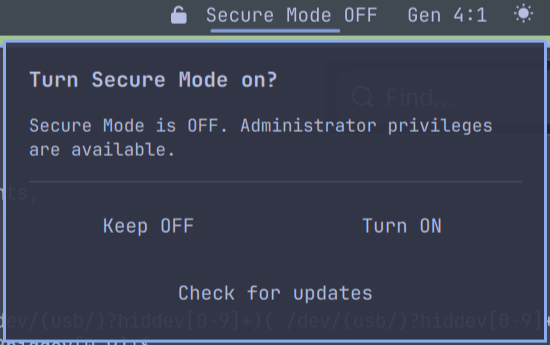

# EscaLock for Omarchy

EscaLock is a Secure Mode bar widget for Omarchy 4. It lets one local desktop
user temporarily give up general administrator elevation, clearly displays the
real system state, and provides an authenticated way to restore access.

> **Security notice:** EscaLock is an independent project and has not undergone
> a professional security audit. I use it on my own systems, but it modifies
> sudo and Polkit authorization and could leave you without normal administrator
> access if something goes wrong. Read the
> [limitations](#what-secure-mode-does-not-do) and
> [recovery instructions](#recovery), keep appropriate backups, and use it at
> your own risk.



## How it works

EscaLock has two user-facing states:

| Widget state | Administrator Mode | General sudo | Generic `pkexec` | Local shutdown/reboot |
| --- | --- | --- | --- | --- |
| Secure Mode **OFF** | ON | Available normally | Handled by the normal system policy | Handled normally |
| Secure Mode **ON** | OFF | Managed general grant removed | Denied for the configured user | Handled normally |

When Secure Mode turns on, EscaLock preserves the managed sudo grant in a
root-only directory and activates an early Polkit deny rule. The only EscaLock
recovery action left available requires authentication as the configured user
and restores Administrator Mode. Explicit systemd-logind shutdown and reboot
actions from the active local session continue through the system's normal
power policy; they do not provide general command execution.

The widget does not remember a preference and assume it succeeded. It reads
the protected sudo and Polkit state, compares the effective sudo policy with
root-owned snapshots, and displays:

- `Secure Mode ON` when the restrictions are verified;
- `Secure Mode OFF` when administrator access is verified; or
- `Secure Mode ?` when the files or effective policies are inconsistent.

EscaLock refuses to guess or perform another transition from an inconsistent
state.

## Requirements

- Omarchy 4.x
- A normal local desktop account
- Either Omarchy's standard `/etc/sudoers.d/00-omarchy-wheel` general grant or
  exactly one Archinstall-style dedicated grant named
  `/etc/sudoers.d/<numeric-prefix>_USER`, where the prefix contains at least two
  digits and is chosen during OS installation
- The standard tools included with a fresh Omarchy installation; `setup.sh`
  checks each required executable before making changes

Setup reports a clear error without installing anything if the system is not
compatible. EscaLock does not install packages or call a package manager. Run
all commands as the desktop user, not from a root shell and not by prefixing
the scripts with `sudo`.

Omarchy installations can use either layout. Setup discovers the exact
dedicated basename without assuming its numeric prefix, validates and records
it in root-owned configuration, and continues using that same file for every
transition, upgrade, rollback, and uninstall. If the system uses the shared
wheel layout, setup preserves the original rule, changes its live user list to
exclude only the configured account, and creates a protected per-user grant
for EscaLock to toggle. Other wheel users remain covered by Omarchy's shared
rule. Uninstall restores the original wheel grant exactly and removes only the
EscaLock-created per-user grant.

## Install

Copy and run this one command as your normal desktop user:

```bash
omarchy plugin add https://github.com/RamenPacket84/omarchy-escalock.git --enable
```

[Review the EscaLock source on GitHub](https://github.com/RamenPacket84/omarchy-escalock)
before installing it.

Omarchy warns that third-party plugins run unsandboxed, clones and validates
the GitHub repository, and enables the widget. On a fresh installation,
EscaLock then opens one guided setup terminal. You do not need to find the
checkout or enter another command.

The guided setup:

1. verifies Omarchy, the GitHub checkout, manifest, build, sudo policy, and
   Polkit rule ordering;
2. shows the exact version, Git commit, target user, and retained sudo
   delegations;
3. asks you to type `install` and authenticate with sudo;
4. creates a root-only recovery backup under
   `/var/backups/omarchy-escalock/`;
5. installs and verifies the system components; and
6. leaves the enabled widget ready in Secure Mode OFF.

Administrator Mode remains ON after installation. Setup never performs the
first Secure Mode transition automatically. Keep the backup path printed at
the end. If you cancel or setup cannot complete, the widget remains visible
with a **Finish setup** button so you can safely retry.

### Check before installing

To run the complete privileged preflight without installing or replacing
system files:

```bash
~/.config/omarchy/plugins/andrewbacon.escalock/setup.sh --check
```

The preflight prints every sudo delegation that would remain usable in Secure
Mode and labels its arguments as exact, patterned, or unrestricted. Review
that list as part of deciding whether Secure Mode meets your needs.

## Use the widget

- Left-click while Secure Mode is OFF to review the warning and turn it on.
- Left-click while Secure Mode is ON to authenticate and restore Administrator
  Mode.
- Middle-click to refresh the authoritative state.

Authentication cancellation makes no change. The widget rereads system state
after every attempted transition.

## Command-line use

The installed CLI follows the same Secure Mode terminology as the widget:

```bash
omarchy-escalock version
omarchy-escalock status
omarchy-escalock on
omarchy-escalock off
omarchy-escalock toggle
```

`status` prints `on`, `off`, or `inconsistent`.

- `on` restricts general administrator elevation.
- `off` authenticates and restores administrator elevation.
- `toggle` changes only a verified state and refuses an inconsistent one.

If the bar is unavailable, `omarchy-escalock off` is also the normal recovery
command.

### Verify the installation

After installation, you can exercise one complete transition from a terminal:

```bash
omarchy-escalock on
sudo -k
sudo -n /usr/bin/true
pkexec /usr/bin/true
omarchy-escalock off
omarchy-escalock status
```

While Secure Mode is ON, the noninteractive `sudo` command should report that a
password is required and generic `pkexec` should report that it is not
authorized. The final status should be `off`. Keep the terminal open until
Administrator Mode has been restored.

## What Secure Mode does not do

Secure Mode limits subsequent general-purpose elevation attempts. It does not:

- stop or contain an already-running root process or shell;
- revoke open privileged descriptors, cached capabilities, or privileged state
  acquired earlier;
- remove the user from `wheel`;
- lock the desktop session, encrypt user files, or prevent offline disk access;
- protect against compromise of root, the kernel, sudo, Polkit, or EscaLock
  itself; or
- remove separately delegated sudo commands supplied by Omarchy.

Setup snapshots all effective sudo rules matching the user. A distinct
additional general `ALL` grant is rejected; an equivalent duplicate that sudo
normalizes into the managed rule makes the Secure Mode transition fail and
roll back. Setup also rejects common general-purpose or shell-escapable
executables. Other executable-scoped delegations remain privileged
capabilities. In particular, a sudo argument wildcard can span whitespace and
may be broader than one apparent argument.

Recovery uses `AUTH_SELF`: anyone who controls the active local session and can
authenticate as the account can restore Administrator Mode. EscaLock is an
intentional privilege gate, not a second authentication factor.

For the full threat model and implementation invariants, see
[Security design](docs/SECURITY-DESIGN.md).

## Update

Restore Administrator Mode before updating, then update both the user-owned
checkout and the privileged components:

```bash
omarchy-escalock off
omarchy plugin update andrewbacon.escalock --yes
~/.config/omarchy/plugins/andrewbacon.escalock/setup.sh
```

Setup displays the new commit, creates a new backup, and rolls back to the
previous recovery path if the upgrade fails. The widget compares its version
with the installed helper and disables transitions while an update is required.

## Uninstall

Run the installed uninstall command as the configured desktop user:

```bash
omarchy-escalock uninstall
```

The command safely performs the following sequence:

1. restores Administrator Mode through the normal authenticated recovery
   action if Secure Mode is ON;
2. refuses to continue if state is inconsistent;
3. verifies the restored sudo grant and complete sudoers policy;
4. creates a root-only uninstall backup;
5. restores Omarchy's original shared wheel grant when setup migrated it,
   removes only EscaLock's fixed paths, and validates sudoers again; and
6. asks Omarchy to remove the user-owned plugin checkout.

Do not run `sudo omarchy-escalock uninstall`, and do not delete the checkout or
system files manually while Secure Mode is ON. If Omarchy cannot remove the
checkout after the system components are removed, the CLI prints the exact
`omarchy plugin remove` command to finish cleanup.

## Recovery

### Normal recovery

If the widget is missing or the Omarchy shell is unavailable, open a terminal:

```bash
omarchy-escalock off
omarchy-escalock status
sudo -k
sudo -v
```

Authenticate as the configured user. The expected final EscaLock status is
`off`.

### Emergency recovery

Use this only if the installed CLI/Polkit recovery path is broken. Boot an
Arch/Omarchy live environment, mount the system root, and enter it with
`arch-chroot`. Then run as root:

```bash
config=/etc/omarchy-escalock/config
target_user=$(sed -n 's/^TARGET_USER=//p' "$config")
grant_basename=$(sed -n 's/^GRANT_BASENAME=//p' "$config")
[[ $target_user =~ ^[a-z_][a-z0-9_-]*$ ]] || exit 1
[[ -n $grant_basename ]] || grant_basename="00_$target_user"
[[ $grant_basename =~ ^[0-9]{2,}_${target_user}$ ]] || exit 1
visudo -cf /etc/omarchy-escalock/sudoers.template
install -o root -g root -m 0440 \
  /etc/omarchy-escalock/sudoers.template "/etc/sudoers.d/$grant_basename"
if grep -Fxq 'GRANT_MODE=omarchy-wheel' /etc/omarchy-escalock/config; then
  install -o root -g root -m 0440 \
    /etc/omarchy-escalock/omarchy-wheel.managed \
    /etc/sudoers.d/00-omarchy-wheel
fi
visudo -c
install -o root -g root -m 0644 \
  /etc/omarchy-escalock/00-00-omarchy-escalock-on.rules.template \
  /etc/polkit-1/rules.d/00-00-omarchy-escalock.rules
rm -f /etc/omarchy-escalock/sudoers.disabled
```

Legacy EscaLock configurations without `GRANT_BASENAME` safely default to
`00_<TARGET_USER>`. Reboot, verify Administrator Mode is restored, and
investigate the failure before using Secure Mode again. The latest root-only
setup backup is another exact recovery source.

## Troubleshooting

### The widget says setup or an update is required

For a fresh installation, click the widget and choose **Finish setup**. If the
guided terminal cannot be opened, run setup from the current plugin checkout:

```bash
~/.config/omarchy/plugins/andrewbacon.escalock/setup.sh --enable
```

For an update, Administrator Mode must be ON first. If needed, run
`omarchy-escalock off`, then follow the commands in [Update](#update).

### Status is `inconsistent`

Do not manually remove recovery files or attempt repeated transitions. Review
the root-owned installation metadata and backups, then run the setup preflight:

```bash
~/.config/omarchy/plugins/andrewbacon.escalock/setup.sh --check
```

If the normal recovery command no longer works, use the emergency procedure
above.

### Setup reports an ambiguous sudo grant

EscaLock requires exactly one recognized general grant source. It refuses to
choose if multiple numeric `<prefix>_<username>` grants exist or if a dedicated
grant coexists with the shared wheel grant. Do not delete sudoers files just to
make setup proceed; inspect the complete policy with `sudo visudo -c` and
determine why the duplicate exists first.

### `pkexec` says “Not authorized” while Secure Mode is ON

That is expected for generic `pkexec` commands. Only EscaLock's fixed recovery
action remains available to the configured user.

## Development

Local development uses an explicit flag so uncommitted files cannot be
mistaken for the published installation payload:

```bash
make clean check
./setup.sh --development --check
./setup.sh --development --enable
```

Production setup builds the exact local Git `HEAD` after rejecting tracked or
staged differences. Untracked files are not included. It hands only a fixed
SHA-256-verified payload to root, records its commit and digest, and never lets
root traverse or modify the plugin checkout in the user's home directory.

Before publishing a release, follow the
[release checklist](docs/RELEASE-CHECKLIST.md).

## License

MIT. See [LICENSE](LICENSE).
